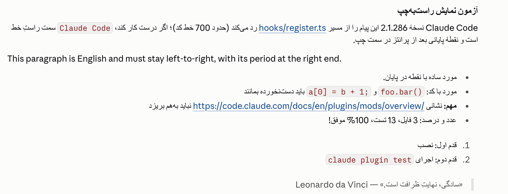

# rtl-mod

A [Claude Code mod](https://code.claude.com/docs/en/plugins/mods/overview) that makes Persian, Arabic and Hebrew messages read correctly in the transcript.



## Install

In the desktop app:

1. Type `/plugin` in the Code tab. It opens the Plugins page.
2. Press **Add** and enter this repository: `https://github.com/justmisam/rtl-mod`
3. Install **RTL messages** from it.

From a terminal:

```bash
claude plugin marketplace add justmisam/rtl-mod
```

```bash
claude plugin install rtl-messages@rtl-mod
```

Either way, every session started after that loads it.

To run it from a clone instead:

```bash
claude --plugin-dir ./mod
```

The desktop app takes no flags, so there the path goes in `~/.claude/settings.json`:

```json
{ "env": { "CLAUDE_CODE_PLUGIN_DIRS": "/absolute/path/to/rtl-mod/mod" } }
```

## What it does

- Every top-level block (paragraph, heading, list, quote, table) gets its own direction. A Persian paragraph is right-aligned with its bullets on the right, and an English paragraph in the same message stays left-to-right.
- Inline code, links and URLs stay left-to-right inside a right-to-left sentence, so `foo.bar()` or a long URL is not reordered.
- In a right-to-left table, `:--` in the delimiter row means the start side, as you would expect.
- Your own prompts are marked too, not only the replies.
- Only the drawing changes. The stored message, and what the model reads, stay as they were.

## How it works

A mod can rewrite the text a message draws, but it cannot set `dir` on it. So the direction travels inside the text, as Unicode bidi controls:

| Where | What is added |
| --- | --- |
| Each line of an RTL block | `RLM` `RLE` before, `PDF` `RLM` after |
| Code spans and URLs | `LRI` before, `PDI` after |
| A line of an LTR block that opens with an RTL letter | `LRM` before |

The desktop transcript gives a block the direction of its first strong character, so the opening mark turns the whole block around: alignment, bullets, quote bar and table columns.

The marks go inside the markdown syntax (after the `#`, the `-` or the `>`), so every block still parses as it did.

## The direction rule

Markdown syntax, code and URLs are stripped first, so only the prose counts. Then a block is right-to-left when:

1. its first letter is an RTL letter, or
2. any of its last three letters is.

The first is what Unicode says. The second is there because a Persian sentence that opens with a Latin name is still Persian.

The rule is in `mod/hooks/direction.ts`.

## Limits

- The terminal is left alone. It lays text out cell by cell, and what it does with a bidi control is up to the emulator.
- The question dialog is left alone. It shows bidi controls as visible characters and lays its text out left-to-right whatever the text opens with.
- A mod cannot change fonts. For Vazirmatn, see the next section.
- Tested with Claude Code 2.1.293 in the desktop app on macOS.

## Vazirmatn font (macOS, optional)

This part is separate from the mod. It makes the desktop app draw Persian and Arabic text in [Vazirmatn](https://github.com/rastikerdar/vazirmatn).

The app's font stack lists "Segoe UI" before Arial, and macOS has no font by that name. A copy of Vazirmatn that holds only Arabic-script characters, installed under that family name, takes Persian over and leaves Latin text alone.

In a terminal:

```bash
curl -fsSL https://raw.githubusercontent.com/justmisam/rtl-mod/main/fonts/install.sh | bash
```

[The script](fonts/install.sh) is short: it downloads Vazirmatn, builds the copy in a temporary folder and puts two files in `~/Library/Fonts`. From a clone, `./fonts/install.sh` does the same.

Then quit the app and open it again. If Persian is still drawn in the old font, log out of your macOS account and log back in. On a new account that is what it took.

Before you do it:

- It is for macOS. Windows has a real Segoe UI, so do not install this there.
- Any page or app that lists "Segoe UI" before a font with Arabic glyphs (GitHub in Chrome, for one) will show Persian and Arabic in Vazirmatn too. Latin text is not affected anywhere.
- Code blocks keep the app's code font.
- If an app update changes its font stack, this stops working until the alias is rebuilt under another name.
- The built files are for your own machine. Do not pass them on.

To undo it:

```bash
rm ~/Library/Fonts/SegoeUI-VazirmatnAlias-Regular.ttf ~/Library/Fonts/SegoeUI-VazirmatnAlias-Bold.ttf
```

The why and the fine print are in [fonts/](fonts/README.md).

## Development

```bash
claude plugin validate mod
```

```bash
claude plugin test mod
```

## License

[MIT](LICENSE)
